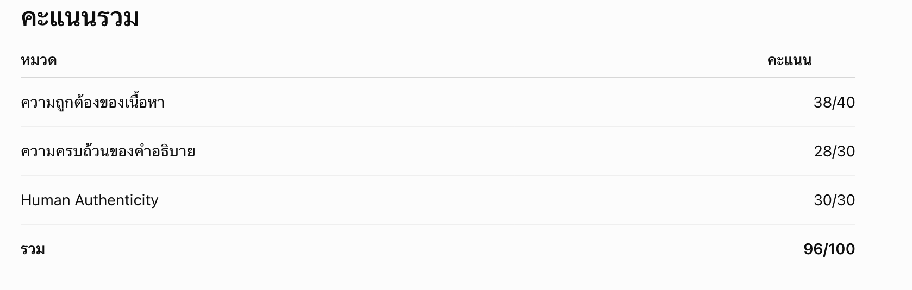
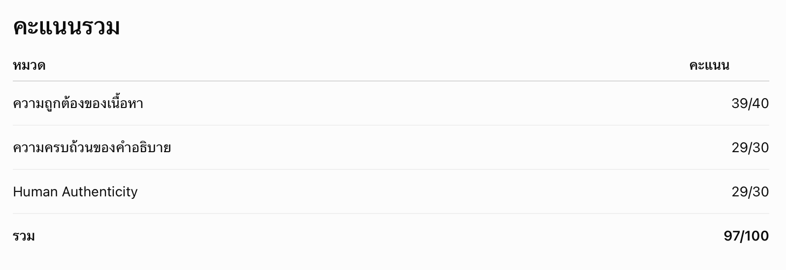
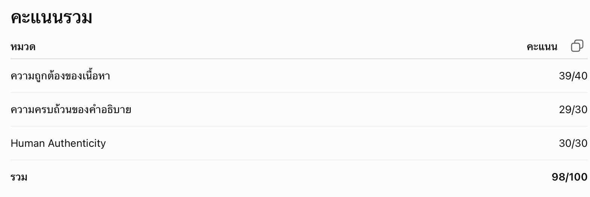

หมวด A — ข้อที่ 1 Introduction to IoT
คำตอบ
Internet of Things หรือ IoT คือการเชื่อมต่ออุปกรณ์ต่าง ๆ เข้ากับอินเทอร์เน็ต เพื่อให้อุปกรณ์สามารถส่งข้อมูลและรับคำสั่งจากกันได้ ทำให้การใช้งานสะดวกขึ้นและช่วยลดการทำงานของคนในบางส่วน
ตัวอย่างที่เราสามารถพบเห็นได้ทั่วไป เช่น เครื่องปรับอากาศอัจฉริยะที่สามารถสั่งเปิดหรือปิดผ่านโทรศัพท์มือถือได้ แม้ว่าเราจะไม่ได้อยู่ที่บ้าน แต่ผู้ใช้ยังสามารถตั้งเวลาเปิดหรือปิดเครื่องผ่านแอปได้อีกด้วย
ซึ่งสำหรับเราแล้ว ระบบนี้ถือว่าเป็น IoT เพราะเครื่องปรับอากาศสามารถเชื่อมต่ออินเทอร์เน็ตและรับคำสั่งจากผู้ใช้ผ่านแอปพลิเคชันได้ จึงทำให้ควบคุมการทำงานได้จากระยะไกล

คะแนนจาก AI

คะแนนรวม
หมวด	                 คะแนน
ความถูกต้องของเนื้อหา	     38/40
ความครบถ้วนของคำอธิบาย	   28/30
Human Authenticity	     30/30
รวม	96/100

ข้อเสนอแนะจาก AI
จุดที่ควรปรับปรุง
เพื่อให้ได้คะแนนใกล้ 100/100 แนะนำเพิ่มเพียงเล็กน้อย เช่น
อธิบายว่าระบบมีการสื่อสารระหว่างอุปกรณ์ แอป และอินเทอร์เน็ต
กล่าวถึงการรับ–ส่งข้อมูลหรือสถานะของอุปกรณ์กลับมายังผู้ใช้ เพื่อให้เห็นภาพการทำงานของระบบ IoT ชัดเจนยิ่งขึ้น

หมวด B — ข้อที่ 2 Application Layer Technology
คำตอบ
Application Layer เป็นชั้นที่ช่วยให้อุปกรณ์ IoT ติดต่อกับระบบหรือแอปพลิเคชัน โดยที่มีโปรโตคอลที่นิยมใช้งาน เช่น MQTT, AMQP และ XMPP ซึ่งตัวของ MQTT เหมาะกับงาน IoT เพราะใช้ข้อมูลไม่มากและทำงานได้รวดเร็ว ตัวอย่างที่เราคิดว่าพบเห็นได้ทั่วไป คือ เซนเซอร์การเกษตร ที่ช่วยตรวจจับอุณหภูมิของสภาพอากาศ และส่งแจ้งเตือนไปยังมือถือของผู้ใช้งาน ส่วน AMQP เหมาะกับระบบที่ต้องการความน่าเชื่อถือในการส่งข้อมูล และ XMPP เหมาะกับงานที่ต้องมีการสื่อสารแบบทันที
จากที่ศึกษา เราคิดว่า MQTT เหมาะกับงาน IoT มากที่สุด เพราะใช้งานง่ายและเป็นโปรโตคอลที่นิยมใช้ในหลายระบบซึ่งเหมาะกับการนำมาประยุกต์ใช้ในชีวิตประจำวันได้อย่างหลากหลาย

คะแนนจาก AI

คะแนนรวม
หมวด	                  คะแนน
ความถูกต้องของเนื้อหา	      39/40
ความครบถ้วนของคำอธิบาย	    29/30
Human Authenticity	      29/30
รวม	97/100

ข้อเสนอแนะจาก AI
จุดที่ควรปรับปรุง
เพื่อให้ได้คะแนนใกล้ 100/100 แนะนำดังนี้
เพิ่มลักษณะเด่นของ MQTT อีกเล็กน้อย เช่น การใช้รูปแบบ Publish/Subscribe หรือการใช้แบนด์วิดท์ต่ำ
เชื่อมโยงตัวอย่างเซนเซอร์การเกษตรกับการทำงานของโปรโตคอลให้ชัดขึ้น เช่น ข้อมูลถูกส่งผ่าน MQTT ไปยังเซิร์ฟเวอร์หรือแอปของผู้ใช้
ปรับประโยคสรุปท้ายให้เฉพาะเจาะจงมากขึ้น แทนคำว่า "ประยุกต์ใช้ในชีวิตประจำวันได้อย่างหลากหลาย" ด้วยการยกตัวอย่างระบบจริง จะช่วยเพิ่มทั้งความน่าเชื่อถือและความเป็นธรรมชาติของภาษา

หมวด C — ข้อที่ 1 IoT-System-Challenges
คำตอบ
การออกแบบระบบ IoT มีหลายเรื่องที่เราต้องคิด เพราะอุปกรณ์แต่ละชนิดมีข้อจำกัดไม่เหมือนกัน หากออกแบบไม่เหมาะสม กับระบบอาจทำงานได้ไม่เต็มประสิทธิภาพ
อย่างแรกเลย คือระยะทางในการสื่อสาร หากอุปกรณ์อยู่ไกลเกินไป อาจทำให้ข้อมูลส่งได้ไม่ดี เราถึงต้องเลือกใช้วิธีการสื่อสารให้เหมาะสมกับตัวของระบบ
ส่วนอีกเรื่องคือ Bandwidth หากเรามีอุปกรณ์หลายตัวส่งข้อมูลพร้อมกัน อาจจะทำให้การส่งข้อมูลล่าช้าได้ นอกจากนี้เรายังต้องคำนึงถึงการใช้พลังงานของอุปกรณ์ โดยเฉพาะอุปกรณ์ที่ใช้แบตเตอรี่ เพราะหากเราต้องการส่งข้อมูลตลอดเวลา พลังงานในแบตเตอรี่อาจหมดเร็ว
ตัวอย่างเช่น ระบบเกษตรอัจฉริยะที่ใช้เซนเซอร์วัดความชื้นในดิน หากพื้นที่มีขนาดใหญ่ ก็ต้องเลือกการสื่อสารที่เหมาะสม เพื่อให้ข้อมูลส่งถึงได้อย่างต่อเนื่องและราบรื่นขึ้น

คะแนนจาก AI

คะแนนรวม
หมวด	               คะแนน
ความถูกต้องของเนื้อหา	   39/40
ความครบถ้วนของคำอธิบาย	 29/30
Human Authenticity	   30/30
รวม	98/100

ข้อเสนอแนะจาก AI
จุดที่ควรปรับปรุง
เพื่อให้มีโอกาสได้ 100/100 แนะนำดังนี้
แก้ไขการพิมพ์เล็กน้อย เช่น ลบคำว่า "กับ" ในประโยคแรกให้เป็น "หากออกแบบไม่เหมาะสม ระบบอาจทำงานได้ไม่เต็มประสิทธิภาพ"
เชื่อมโยงแต่ละความท้าทายกับแนวทางการออกแบบระบบให้ชัดขึ้น เช่น
ระยะทาง → เลือกใช้ LoRa หรือ NB-IoT
Bandwidth → ลดความถี่ในการส่งข้อมูล
พลังงาน → ใช้โหมดประหยัดพลังงาน (Sleep Mode)
ในตัวอย่างระบบเกษตรอัจฉริยะ อาจกล่าวถึงผลกระทบของพลังงานหรือการส่งข้อมูลร่วมด้วย เพื่อเชื่อมโยงกับทุกประเด็นที่อธิบายไว้
