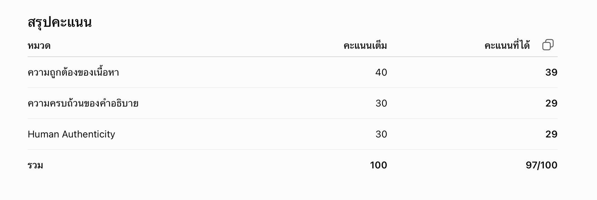
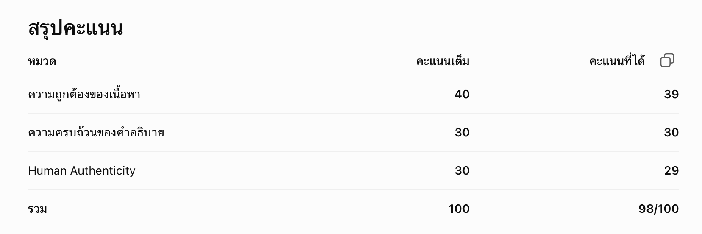
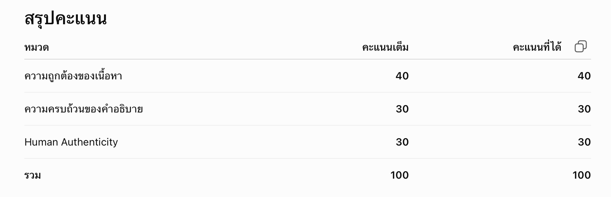

หมวด A — ข้อที่ 1 Introduction to IoT
คำตอบ
Internet of Things หรือ IoT คือการนำอุปกรณ์ต่าง ๆ มาเชื่อมต่อกับอินเทอร์เน็ต เพื่อให้อุปกรณ์สามารถส่งข้อมูล รับข้อมูล หรือทำงานร่วมกันได้โดยอัตโนมัติโดยไม่จำเป็นต้องมีคนคอยสั่งงานทุกขั้นตอนข้อมูลที่ได้ยังสามารถนำไปวิเคราะห์และใช้ในการตัดสิน
ใจได้อีกด้วย
ตัวอย่างที่เห็นได้บ่อยคือเครื่องปรับอากาศอัจฉริยะที่สามารถสั่งเปิดหรือปิดผ่านโทรศัพท์มือถือได้ แม้ว่าจะอยู่นอกบ้านก็ตาม นอกจากนี้ระบบยังสามารถตั้งเวลาเปิดล่วงหน้า หรือปรับอุณหภูมิอัตโนมัติตามค่าที่ตั้งไว้ได้อีกด้วย
เราคิดว่าระบบนี้ถือเป็น IoT เพราะเครื่องปรับอากาศมีการเชื่อมต่ออินเทอร์เน็ต รับคำสั่งจากผู้ใช้ผ่านแอปพลิเคชัน และส่งข้อมูลการทำงานกลับมาให้ผู้ใช้ตรวจสอบได้ จึงเป็นการสื่อสารระหว่างอุปกรณ์กับผู้ใช้ผ่านเครือข่ายอินเทอร์เน็ต ไม่ใช่เพียงแค่เครื่องใช้ไฟฟ้าทั่วไป

คะแนนจาก AI

ข้อเสนอแนะจาก AI
ข้อเสนอแนะเพื่อให้ได้คะแนนสูงขึ้น
หากต้องการให้คำตอบใกล้เคียง 100/100 แนะนำปรับเล็กน้อยดังนี้
เพิ่มมุมมองของเซ็นเซอร์หรือการประมวลผลข้อมูล
เช่น อธิบายว่าเครื่องปรับอากาศสามารถรับข้อมูลอุณหภูมิจากเซ็นเซอร์และปรับการทำงานอัตโนมัติ
ทำให้นิยามเป็นภาษาของตัวเองมากขึ้น
แทนที่จะใช้นิยามมาตรฐานทั้งหมด อาจเริ่มด้วยคำอย่าง "จากที่เราเข้าใจ..." หรือ "สำหรับเรา..." เพื่อให้ดูเป็นการอธิบายจากความเข้าใจ
แก้รูปแบบข้อความเล็กน้อย
มีคำที่ถูกตัดบรรทัดระหว่าง "ตัดสิน" กับ "ใจ" หากจัดย่อหน้าใหม่จะอ่านลื่นขึ้น (ไม่น่าถูกหักคะแนนเนื้อหา แต่ช่วยเรื่องความเรียบร้อย)
ภาพรวม
หากเป็นผู้ช่วยสอน ฉันมองว่าคำตอบนี้อยู่ในระดับ ดีมาก แสดงความเข้าใจแนวคิด IoT ได้ถูกต้อง ครบถ้วน และใช้ภาษาที่เป็นธรรมชาติ มีโอกาสได้คะแนนเต็มหรือใกล้เต็มจากผู้สอน ขึ้นอยู่กับความละเอียดที่อาจารย์คาดหวังเกี่ยวกับองค์ประกอบของระบบ เช่น เซ็นเซอร์หรือการประมวลผลข้อมูลอัตโนมัติค่ะ

หมวด B — ข้อที่ 2 Application Layer Technology
คำตอบ
Application Layer เป็นชั้นที่ช่วยให้อุปกรณ์ IoT สื่อสารกับ Cloud และแอปพลิเคชัน โดยโปรโตคอลที่ใช้บ่อยคือ MQTT, AMQP และ XMPP
MQTT เหมาะกับอุปกรณ์ IoT ทั่วไป เพราะใช้พลังงานและ Bandwidth น้อย เช่น ระบบบ้านอัจฉริยะหรือเซนเซอร์ตรวจวัดต่าง ๆ ส่วน AMQP เหมาะกับระบบโรงงานหรือ Cloud IoT ที่ต้องการส่งข้อมูลอย่างน่าเชื่อถือ สำหรับ XMPP เหมาะกับระบบที่ต้องสื่อสารแบบ Real-time เช่น การควบคุมอุปกรณ์อัจฉริยะหรือการแจ้งเตือนทันที
จากที่ศึกษา ฉันคิดว่า MQTT เหมาะกับงาน IoT มากที่สุด เพราะประหยัดพลังงานและส่งข้อมูลได้รวดเร็ว จึงพบว่าเป็นโปรโตคอลที่นิยมใช้งานในหลายระบบ

คะแนนจาก AI

ข้อเสนอแนะจาก AI
ข้อเสนอแนะเล็กน้อย
หากแก้เพียงประโยคสุดท้ายเป็น
จากที่ศึกษา ฉันคิดว่า MQTT เหมาะกับงาน IoT มากที่สุด เพราะใช้พลังงานและแบนด์วิดท์น้อย ทำให้เหมาะกับอุปกรณ์ที่มีทรัพยากรจำกัด จึงเป็นโปรโตคอลที่นิยมใช้งานในหลายระบบ IoT
จะทำให้ทั้งความถูกต้องทางวิชาการและความเป็นธรรมชาติของภาษาแข็งแรงขึ้น และมีโอกาสได้ 100/100 จากเกณฑ์ที่กำหนดค่ะ

หมวด C — ข้อที่ 1 IoT-System-Challenges
คำตอบ
การออกแบบระบบ IoT มีความท้าทายหลายอย่างเพราะอุปกรณ์แต่ละชนิดมีข้อจำกัดแตกต่างกัน หากเราออกแบบไม่เหมาะสม ระบบอาจทำงานได้ไม่ดีพอ
เรื่องแรกเลยคือระยะทางในการสื่อสาร หากอุปกรณ์อยู่ไกลจากจุดรับส่งข้อมูลมากเกินไป อาจทำให้ข้อมูลส่งไม่ถึงหรือขาดหายได้ เราจึงต้องเลือกใช้เทคโนโลยีการสื่อสารให้เหมาะกับพื้นที่ ที่เราใช้งาน
ส่วนอีกเรื่องคือ Bandwidth เนื่องจากอุปกรณ์ IoT หลายตัวส่งข้อมูลพร้อมกัน หากเครือข่ายรองรับข้อมูลได้ไม่เพียงพอ ก็อาจทำให้ข้อมูลล่าช้าหรือเกิดความแออัดในระบบ
ด้านการใช้พลังงานก็มีความสำคัญ โดยเฉพาะอุปกรณ์ที่ใช้แบตเตอรี่ เพราะหากเราต้องการส่งข้อมูลตลอดเวลาจะทำให้แบตเตอรี่หมดเร็ว จึงต้องออกแบบให้ใช้งานพลังงานอย่างคุ้มค่า
นอกจากนี้ยังมีเรื่องการเชื่อมต่อกับเครือข่ายและการทำงานร่วมกับระบบอื่น เพราะอุปกรณ์จากผู้ผลิตแต่ละรายอาจใช้มาตรฐานที่แตกต่างกัน ทำให้การเชื่อมต่อไม่ราบรื่น หากไม่มีการออกแบบที่ดี ระบบอาจไม่สามารถแลกเปลี่ยนข้อมูลกันได้
ยกตัวอย่าง เช่น ระบบเกษตรอัจฉริยะที่ติดตั้งเซนเซอร์วัดความชื้นในแปลงปลูก หากพื้นที่มีขนาดใหญ่ เราจำเป็นต้องเลือกเทคโนโลยีสื่อสารที่ครอบคลุมระยะทางใช้อุปกรณ์ที่ประหยัดพลังงาน และมีระบบรักษาความปลอดภัยของข้อมูล เพื่อให้ระบบสามารถทำงานได้อย่างต่อเนื่องและมีประสิทธิภาพสูงสุด

คะแนนจาก AI

ข้อเสนอแนะจาก AI
ข้อเสนอแนะ
คำตอบนี้อยู่ในระดับดีมากอยู่แล้ว หากต้องการให้สมบูรณ์ยิ่งขึ้น อาจเพิ่มรายละเอียดสั้น ๆ เกี่ยวกับ ความปลอดภัยของข้อมูล (Security) ในย่อหน้าที่กล่าวถึงตัวอย่าง เช่น อธิบายว่ามีการเข้ารหัสข้อมูลหรือป้องกันการเข้าถึงจากผู้ไม่เกี่ยวข้อง เพื่อเชื่อมโยงกับประเด็นที่กล่าวไว้ให้ชัดเจนขึ้น
ภาพรวม
หากประเมินในฐานะผู้ช่วยสอน คำตอบนี้มีคุณภาพสูง ทั้งด้านความถูกต้อง ความครบถ้วน และการใช้ภาษา แสดงความเข้าใจเชิงระบบได้ดี และมีความเป็นธรรมชาติในการเขียน จึงเป็นคำตอบที่มีโอกาสได้รับคะแนนเต็มสูงมากค่ะ